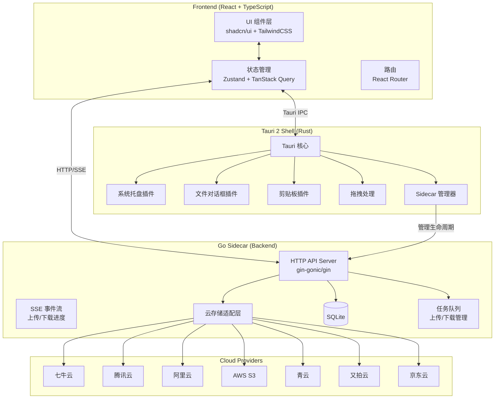

# Cloud-Storage-Manager 技术路线与实施计划

> **目标**：全面复刻 [qiniuClient](https://github.com/willnewii/qiniuClient)，使用现代技术栈重新构建一个跨平台云存储管理客户端，保留原项目全部功能。

---

## 一、原项目分析

### 1.1 原技术栈（已过时）

| 技术 | 现状 |
|------|------|
| Electron 13 | 严重过时，安全漏洞 |
| Vue 2.x | 已停止维护 (EOL) |
| Vuex 3.x | Vue 2 绑定，已过时 |
| iView 3.x (view-design) | 已停止维护 |
| Webpack 4 | 性能和功能落后 |
| electron-builder | 仍可用但与 Electron 绑定 |

### 1.2 原项目功能清单

**核心功能：**
- [x] 多云存储支持（七牛云、腾讯云、青云、阿里云、又拍云、AWS S3、京东云）
- [x] 多账户登录 & 最近登录记录
- [x] Bucket 列表浏览与切换
- [x] 仿文件夹式资源浏览（模拟目录层级）
- [x] 文件列表视图 & 图片网格视图
- [x] 图片预览（含 webp 格式）
- [x] 文件上传（本地文件、文件夹批量上传）
- [x] 拖拽上传
- [x] URL 抓取上传（七牛、腾讯、青云）
- [x] 剪贴板上传（mac & win）
- [x] 系统托盘上传（mac 特性）
- [x] 文件下载
- [x] 文件删除（单个 & 批量）
- [x] 文件重命名
- [x] 文件搜索 & 过滤（日期/大小排序）
- [x] 批量选择操作
- [x] 批量导出 URL
- [x] 右键上下文菜单
- [x] Bucket 同步功能
- [x] CDN 缓存刷新（七牛）
- [x] 私有空间支持
- [x] 自定义域名
- [x] HTTPS 开关
- [x] 分页模式（针对大数据量 Bucket）
- [x] Dark / Light 主题切换（mac 自动跟随系统）
- [x] IndexedDB 缓存（优化大 Bucket 加载）
- [x] 上传/下载队列管理
- [x] 上传成功自动复制链接
- [x] 隐藏删除按钮选项
- [x] 加载大 Bucket 时手动取消

### 1.3 原项目云存储适配器架构

```
cos/
├── CloudObjectStorage.js   # 入口，根据品牌分发到对应适配器
├── baseBucket.js            # 基类，定义统一接口
├── brand.js                 # 品牌常量定义
├── Regions.json             # 各云厂商 Region 配置
├── qiniu.js / qiniuBucket.js         # 七牛云
├── tencent.js / tencentBucket.js     # 腾讯云
├── ali.js / aliBucket.js             # 阿里云
├── qing.js / qingBucket.js           # 青云
├── upyun.js / upyunBucket.js         # 又拍云
├── aws.js / awsBucket.js             # AWS S3
├── jd.js                             # 京东云（S3 兼容）
└── ks3.js / ks3Bucket.js             # 金山云
```

**每个适配器实现的统一接口：**
- `init(accessKey, secretKey)` — 初始化认证
- `getBuckets()` — 获取 Bucket 列表
- `list(params)` — 列出 Bucket 内文件
- `upload(params)` — 上传文件
- `remove(bucket, items)` — 删除文件
- `rename(bucket, items)` — 重命名文件
- `generateUrl(domain, key, deadline)` — 生成访问 URL（含私有签名）
- `refreshUrls(urls)` — CDN 缓存刷新
- `fetch(params)` — URL 抓取上传

---

## 二、新技术栈选型

### 2.1 桌面框架对比

| 维度 | Electron | Tauri 2 | Wails |
|------|----------|---------|-------|
| 安装包体积 | 150MB+ | 3-10MB | 5-15MB |
| 内存占用 | 高（Chromium） | 低（系统 WebView） | 低 |
| 系统托盘 | ✅ 成熟 | ✅ 官方插件 | ✅ 支持 |
| 跨平台 | ✅ | ✅ | ✅ |
| 拖拽上传 | ✅ | ✅ | ✅ |
| 剪贴板 | ✅ | ✅ 官方插件 | ✅ |
| 文件对话框 | ✅ | ✅ 官方插件 | ✅ |
| 生态成熟度 | ⭐⭐⭐⭐⭐ | ⭐⭐⭐⭐ | ⭐⭐⭐ |
| 打包工具 | electron-builder | tauri-cli (内置) | wails build |
| 后端语言 | Node.js | Rust (+ sidecar) | Go |

> [!IMPORTANT]
> **选择 Tauri 2** — 安装包小（~10MB vs ~150MB），内存占用低，Tauri 2 的插件生态已成熟（tray、dialog、clipboard、fs、shell 等均有官方插件），且原生支持 sidecar 管理。

### 2.2 云存储 SDK 策略

**关键观察：** 大多数云厂商都支持 S3 兼容协议。

| 云厂商 | S3 兼容 | Go 官方 SDK | Node.js SDK | Rust SDK |
|--------|---------|------------|------------|---------|
| 七牛云 | ✅ | ✅ `qiniu/go-sdk` | ✅ | ❌ |
| 腾讯 COS | ✅ | ✅ `cos-go-sdk-v5` | ✅ | ❌ |
| 阿里 OSS | ✅ | ✅ `aliyun-oss-go-sdk` | ✅ | ❌ |
| AWS S3 | ✅ | ✅ `aws-sdk-go-v2` | ✅ | ✅ |
| 青云 | ✅ | ✅ `qingstor-sdk-go` | ✅ | ❌ |
| 又拍云 | ❌ | ✅ `upyun-go-sdk` | ✅ | ❌ |
| 京东云 | ✅ | ✅ (S3 兼容) | ✅ | ❌ |

> [!IMPORTANT]
> **选择 Go 作为后端语言**（以 Tauri sidecar 形式运行）。理由：
> 1. 所有 7 个云厂商都有官方 Go SDK
> 2. `minio-go` 可统一处理所有 S3 兼容操作，大幅减少重复代码
> 3. Go 编译为单个静态二进制文件，完美适配 Tauri sidecar
> 4. Go 的文件 I/O 和并发模型非常适合上传/下载任务管理
> 5. Rust 在中国云厂商 SDK 方面几乎为零

**适配器策略：`minio-go` 统一层 + 各厂商 SDK 补充**

```
┌─────────────────────────────────────────┐
│         统一存储接口 (Go Interface)        │
├─────────────────────────────────────────┤
│  S3 兼容层 (minio-go)                    │
│  - ListBuckets / ListObjects             │
│  - PutObject / GetObject / DeleteObject  │
│  - CopyObject (重命名)                   │
│  - PresignedGetObject (URL 生成)         │
├─────────────────────────────────────────┤
│  厂商特定 API (各自 Go SDK / HTTP 调用)    │
│  - 七牛: URL Fetch, CDN Refresh, Domains │
│  - 又拍: 非 S3 的全部操作                 │
│  - 腾讯: 域名管理                         │
│  - 阿里: Bucket 区域查询                  │
└─────────────────────────────────────────┘
```

### 2.3 前端技术选型

| 维度 | 选择 | 理由 |
|------|------|------|
| 框架 | **React 18 + TypeScript** | 类型安全，生态最丰富，与 shadcn/ui 天然契合 |
| 构建 | **Vite 6** | 极快的 HMR，Tauri 官方推荐搭配 |
| CSS | **TailwindCSS 4** | 符合已有 ui-rules.md 规范 |
| 组件库 | **shadcn/ui** | 高度可定制，不引入重依赖，与已有设计系统一致 |
| 状态管理 | **Zustand** | 轻量简洁，比 Redux 少 90% 样板代码 |
| 异步数据 | **TanStack Query** | 自动缓存、失效、重试，完美处理云 API 调用 |
| 路由 | **React Router v7** | 标准选择 |
| 虚拟滚动 | **TanStack Virtual** | 高性能大列表渲染（替代原项目 vue-virtual-scroll-list）|
| 图片预览 | **react-medium-image-zoom** 或自研 | 替代原项目 v-viewer |
| 右键菜单 | **@radix-ui/react-context-menu** | shadcn/ui 内置支持 |
| 拖拽 | **react-dropzone** | 文件拖拽上传 |
| 国际化 | **i18next** | 中英文支持 |
| 图标 | **Lucide React** | shadcn/ui 默认图标库 |

### 2.4 数据存储

| 维度 | 选择 | 理由 |
|------|------|------|
| 数据库 | **SQLite**（`modernc.org/sqlite`，纯 Go 实现） | 无 CGO 依赖，跨平台编译无障碍 |
| 存储内容 | 账户信息、Bucket 缓存、设置、上传/下载历史 | 替代原项目 IndexedDB + electron-json-storage |
| 敏感信息 | AES 加密存储 accessKey/secretKey | 保障安全性 |

---

## 三、系统架构

### 3.1 整体架构图



### 3.2 前后端通信方式

```
Frontend ←──(HTTP JSON API)──→ Go Sidecar   # 常规请求
Frontend ←──(SSE)────────────→ Go Sidecar   # 实时进度推送
Frontend ←──(Tauri IPC)──────→ Rust Shell   # 系统功能调用
```

**Go Sidecar 启动流程：**
1. Tauri Rust 层启动 Go sidecar 进程
2. Go sidecar 在随机可用端口启动 HTTP server，绑定 `127.0.0.1`
3. Go 通过 stdout 输出端口号
4. Tauri Rust 读取端口号，通过 Tauri IPC 传递给前端
5. 前端所有云存储 API 请求直接发往 `http://127.0.0.1:{port}`
6. 使用启动时生成的随机 token 做请求认证，防止其他进程访问

### 3.3 Go 云存储适配器接口设计

```go
// StorageProvider 定义统一的云存储操作接口
type StorageProvider interface {
    // Init 使用凭证初始化
    Init(cfg ProviderConfig) error

    // ListBuckets 获取存储桶列表
    ListBuckets(ctx context.Context) ([]BucketInfo, error)

    // ListObjects 列出存储桶内的对象
    ListObjects(ctx context.Context,
        params ListParams) (*ListResult, error)

    // UploadObject 上传文件
    UploadObject(ctx context.Context,
        params UploadParams) error

    // DeleteObjects 批量删除对象
    DeleteObjects(ctx context.Context,
        bucket string, keys []string) error

    // RenameObject 重命名对象
    RenameObject(ctx context.Context,
        params RenameParams) error

    // GenerateURL 生成访问链接（含私有签名）
    GenerateURL(params URLParams) (string, error)

    // GetProviderFeatures 返回该厂商支持的特殊功能
    GetProviderFeatures() []Feature
}

// ProviderSpecific 定义厂商特定操作（可选实现）
type ProviderSpecific interface {
    // FetchURL 通过 URL 抓取文件到云端（七牛等）
    FetchURL(ctx context.Context,
        params FetchParams) error

    // RefreshCDN 刷新 CDN 缓存
    RefreshCDN(ctx context.Context,
        urls []string) error

    // ListDomains 获取 Bucket 绑定的域名
    ListDomains(ctx context.Context,
        bucket string) ([]string, error)
}
```

---

## 四、项目目录结构

```
Cloud-Storage-Manager/
├── src-tauri/                    # Tauri Rust 层
│   ├── src/
│   │   ├── main.rs              # 入口
│   │   ├── lib.rs               # Tauri 命令注册
│   │   ├── tray.rs              # 系统托盘逻辑
│   │   ├── sidecar.rs           # Go sidecar 管理
│   │   └── commands/            # Tauri IPC 命令
│   ├── Cargo.toml
│   ├── tauri.conf.json
│   ├── icons/
│   └── binaries/                # Go sidecar 编译产物
│
├── src/                          # React 前端
│   ├── main.tsx
│   ├── App.tsx
│   ├── index.css                # TailwindCSS 入口 + 设计 tokens
│   ├── components/
│   │   ├── ui/                  # shadcn/ui 基础组件
│   │   ├── layout/
│   │   │   ├── AppLayout.tsx    # 主布局
│   │   │   ├── Sidebar.tsx      # 左侧 Bucket 列表
│   │   │   └── Header.tsx       # 顶部操作栏
│   │   ├── bucket/
│   │   │   ├── BucketList.tsx
│   │   │   └── BucketCard.tsx
│   │   ├── resource/
│   │   │   ├── ResourceTable.tsx    # 文件列表视图
│   │   │   ├── ResourceGrid.tsx     # 图片网格视图
│   │   │   ├── ResourceFilter.tsx   # 搜索 & 过滤
│   │   │   └── ResourceContextMenu.tsx
│   │   ├── upload/
│   │   │   ├── UploadModal.tsx
│   │   │   ├── UploadDropzone.tsx
│   │   │   └── UploadQueue.tsx
│   │   ├── preview/
│   │   │   └── ImagePreview.tsx
│   │   └── settings/
│   │       └── SettingsDialog.tsx
│   ├── pages/
│   │   ├── LoginPage.tsx        # 账户选择/添加
│   │   ├── BucketPage.tsx       # Bucket 列表页
│   │   ├── ResourcePage.tsx     # 文件浏览主页
│   │   └── SettingsPage.tsx     # 设置页
│   ├── stores/
│   │   ├── useAccountStore.ts   # 账户状态
│   │   ├── useBucketStore.ts    # Bucket 状态
│   │   ├── useResourceStore.ts  # 文件列表状态
│   │   ├── useUploadStore.ts    # 上传队列状态
│   │   └── useSettingsStore.ts  # 设置状态
│   ├── hooks/
│   │   ├── useCloudApi.ts       # Go API 调用封装
│   │   ├── useSSE.ts            # SSE 进度监听
│   │   └── useTauriEvent.ts     # Tauri 事件监听
│   ├── lib/
│   │   ├── api-client.ts        # HTTP 客户端
│   │   ├── constants.ts
│   │   └── utils.ts
│   └── types/
│       ├── cloud.ts             # 云存储类型定义
│       ├── account.ts
│       └── common.ts
│
├── sidecar/                      # Go 后端
│   ├── main.go                  # 入口
│   ├── go.mod / go.sum
│   ├── internal/
│   │   ├── server/
│   │   │   ├── server.go        # HTTP server 启动
│   │   │   ├── router.go        # 路由注册
│   │   │   ├── middleware.go    # 认证中间件
│   │   │   └── sse.go           # SSE 推送
│   │   ├── handler/             # HTTP handler
│   │   │   ├── account.go
│   │   │   ├── bucket.go
│   │   │   ├── resource.go
│   │   │   ├── upload.go
│   │   │   ├── download.go
│   │   │   └── settings.go
│   │   ├── storage/             # 云存储适配层
│   │   │   ├── provider.go      # 统一接口定义
│   │   │   ├── factory.go       # 适配器工厂
│   │   │   ├── s3compat/        # S3 兼容通用实现(minio-go)
│   │   │   │   └── s3.go
│   │   │   ├── qiniu/           # 七牛适配器
│   │   │   │   ├── qiniu.go
│   │   │   │   └── bucket.go
│   │   │   ├── tencent/         # 腾讯云适配器
│   │   │   ├── ali/             # 阿里云适配器
│   │   │   ├── qingstor/        # 青云适配器
│   │   │   ├── upyun/           # 又拍云适配器
│   │   │   ├── aws/             # AWS 适配器
│   │   │   └── jd/              # 京东云适配器
│   │   ├── database/
│   │   │   ├── db.go            # SQLite 连接管理
│   │   │   ├── migration.go     # 数据表迁移
│   │   │   ├── account.go       # 账户 CRUD
│   │   │   └── settings.go      # 设置 CRUD
│   │   ├── queue/
│   │   │   ├── manager.go       # 任务队列管理器
│   │   │   ├── upload.go        # 上传任务
│   │   │   └── download.go      # 下载任务
│   │   └── crypto/
│   │       └── encrypt.go       # AES 加密工具
│   └── Makefile                 # 跨平台编译脚本
│
├── package.json
├── vite.config.ts
├── tailwind.config.ts
├── tsconfig.json
├── Makefile                      # 顶层构建脚本
└── README.md
```

---

## 五、分阶段开发计划

### Phase 1：项目骨架搭建（预计 2-3 天）

| 任务 | 内容 |
|------|------|
| P1-1 | 初始化 Tauri 2 + React + Vite + TypeScript 项目 |
| P1-2 | 配置 TailwindCSS + shadcn/ui + 设计系统 tokens |
| P1-3 | 初始化 Go sidecar 项目（go mod、目录结构） |
| P1-4 | 实现 Tauri ↔ Go sidecar 生命周期管理与通信机制 |
| P1-5 | 搭建前端路由和基础布局（AppLayout、Sidebar、Header）  |
| P1-6 | Go 端 SQLite 初始化 + 数据表迁移 |
| P1-7 | Go 端 HTTP server + 认证中间件 + SSE 基础设施 |
| P1-8 | 前端 API client + SSE hook 封装 |

### Phase 2：账户管理 & 云厂商接入（预计 3-4 天）

| 任务 | 内容 |
|------|------|
| P2-1 | 实现账户 CRUD API（Go handler + SQLite）|
| P2-2 | 实现 AES 加密存储 accessKey/secretKey |
| P2-3 | 前端登录页 — 添加/选择/删除账户 |
| P2-4 | 实现 `StorageProvider` 接口 + 工厂模式 |
| P2-5 | 实现 S3 兼容通用适配器（minio-go）|
| P2-6 | 实现七牛云适配器（含特有功能：URL Fetch、CDN 刷新、域名列表）|
| P2-7 | 实现腾讯云适配器 |
| P2-8 | 实现阿里云适配器 |
| P2-9 | 实现青云适配器 |
| P2-10 | 实现又拍云适配器（非 S3，需完整实现）|
| P2-11 | 实现 AWS S3 适配器 |
| P2-12 | 实现京东云适配器（S3 兼容层即可）|

### Phase 3：核心文件管理功能（预计 4-5 天）

| 任务 | 内容 |
|------|------|
| P3-1 | Bucket 列表获取与展示 |
| P3-2 | 文件列表获取 — 分页加载 + 虚拟滚动 |
| P3-3 | 仿文件夹导航（prefix 模拟目录）|
| P3-4 | 文件列表视图（ResourceTable）|
| P3-5 | 图片网格视图（ResourceGrid）|
| P3-6 | 搜索与过滤功能（日期/大小排序）|
| P3-7 | 文件删除（单个 & 批量）|
| P3-8 | 文件重命名 |
| P3-9 | 右键上下文菜单 |
| P3-10 | 批量选择操作 |
| P3-11 | 批量导出 URL |
| P3-12 | 自定义域名选择 & HTTPS 开关 |
| P3-13 | 私有空间 URL 签名生成 |
| P3-14 | 大 Bucket 加载优化（手动取消 + 缓存）|

### Phase 4：上传/下载系统（预计 3-4 天）

| 任务 | 内容 |
|------|------|
| P4-1 | Go 端上传/下载任务队列管理器 |
| P4-2 | SSE 进度推送实现 |
| P4-3 | 文件上传（含分片上传 + 断点续传）|
| P4-4 | 上传进度展示 UI |
| P4-5 | 文件夹批量上传 |
| P4-6 | 拖拽上传（Tauri Drag-and-Drop 事件）|
| P4-7 | URL 抓取上传 |
| P4-8 | 剪贴板上传 |
| P4-9 | 文件下载 + 进度展示 |
| P4-10 | 上传成功自动复制链接到剪贴板 |

### Phase 5：系统功能集成（预计 2-3 天）

| 任务 | 内容 |
|------|------|
| P5-1 | 系统托盘 — 显示图标、托盘菜单 |
| P5-2 | 系统托盘 — 快速上传功能 |
| P5-3 | Dark / Light 主题切换 + 跟随系统 |
| P5-4 | 图片预览功能（大图查看器）|
| P5-5 | 设置页面（HTTPS、删除按钮显示、主题等）|
| P5-6 | Bucket 同步功能 |
| P5-7 | CDN 缓存刷新 |

### Phase 6：打磨与打包（预计 2-3 天）

| 任务 | 内容 |
|------|------|
| P6-1 | Go sidecar 跨平台编译脚本（macOS amd64/arm64, Windows, Linux）|
| P6-2 | Tauri 打包配置（icons, metadata, sidecar 绑定）|
| P6-3 | macOS 打包（.dmg）|
| P6-4 | Windows 打包（.exe / NSIS installer）|
| P6-5 | Linux 打包（AppImage / deb）|
| P6-6 | 整体功能回归测试 |
| P6-7 | 性能优化（首屏加载、大列表、并发上传）|

---

## 六、技术选型总表

| 层|技术 | 版本 |
|------|------|------|
| 桌面框架 | Tauri | 2.x |
| 桌面 Shell | Rust | 1.75+ |
| 前端框架 | React | 18.x |
| 前端语言 | TypeScript | 5.x |
| 构建工具 | Vite | 6.x |
| CSS 框架 | TailwindCSS | 4.x |
| UI 组件 | shadcn/ui | latest |
| 状态管理 | Zustand | 5.x |
| 异步数据 | TanStack Query | 5.x |
| 虚拟滚动 | TanStack Virtual | 3.x |
| 路由 | React Router | 7.x |
| 后端语言 | Go | 1.22+ |
| HTTP 框架 | gin-gonic/gin | 1.10+ |
| S3 客户端 | minio/minio-go | 7.x |
| 数据库 | modernc.org/sqlite | latest |
| 加密 | Go crypto/aes | stdlib |
| 系统托盘 | tauri-plugin-tray | 2.x (官方) |
| 剪贴板 | tauri-plugin-clipboard | 2.x (官方) |
| 文件对话框 | tauri-plugin-dialog | 2.x (官方) |
| 文件系统 | tauri-plugin-fs | 2.x (官方) |
| Shell/进程 | tauri-plugin-shell | 2.x (官方) |

---

## 七、需要用户确认的决策点


> - **方案 A**：托盘菜单中添加"上传文件"选项，点击后弹出文件选择器
> ### 2. Go HTTP 框架选择
> - **gin**：最流行，性能优秀，中间件生态丰富

> [!IMPORTANT]
> ### 3. 项目名称和 AppID
> - 项目名称继续使用 **cloud-pika**
> - AppID 建议使用类似 `com.goll.cloud-pika` 的格式，请确认域名前缀

---

## 八、风险与缓解措施

| 风险 | 影响 | 缓解措施 |
|------|------|---------|
| 又拍云无 S3 兼容 | 需完整实现独立适配器 | 优先级最低，其他厂商完成后再做 |
| 各厂商 S3 兼容的细微差异 | 某些操作可能失败 | 先用 minio-go，失败时 fallback 到厂商 SDK |
| WebView 跨平台渲染差异 | UI 在不同系统表现不一致 | 使用 TailwindCSS reset + 充分测试 |
| Go sidecar 异常退出 | 应用不可用 | Tauri 端实现自动重启 + 健康检查 |
| 大文件上传中断 | 用户体验差 | 实现分片上传 + 断点续传 |
